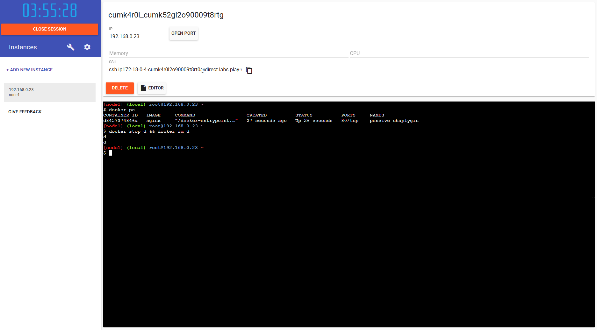

# 1. Crea tu cuenta en docker hub

# 2. Ejecuta un contenedor en Play With Docker

# 3. Detén el contenedor & Borra el contenedor

# 4. Crea un nuevo contenedor con el nombre de tu usuario de correo (Ej: scadena) & Publica el puerto 80

# 5. Sube las evidencias a un repositorio de Git y compártelo conmigo a scadena@unicesar.edu.co
